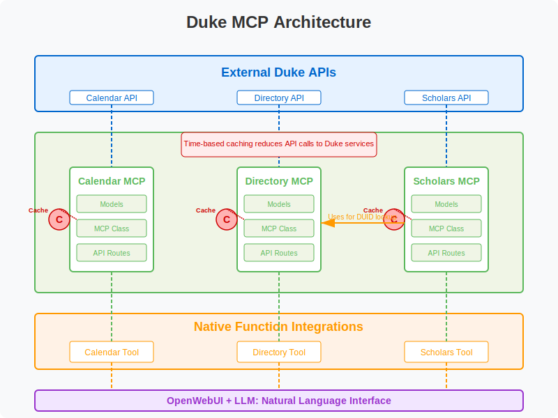

# Duke MCP (Multi-purpose Communication Protocol)

## Project Overview

The Duke MCP is a unified backend server that provides natural language access to various Duke University services through OpenWebUI. This system allows users to interact with university resources through simple, conversational queries rather than navigating complex APIs or web interfaces.

The MCP acts as a middleware layer between Duke's existing data services and the Large Language Model (LLM) interface, providing intelligent caching, data transformation, and integration between systems.



## Core Components

The Duke MCP currently integrates three main services:

### 1. Calendar MCP

The Calendar MCP provides access to Duke's event calendar system, allowing natural language queries about campus events.

**Key Features:**
- Natural language time parsing (e.g., "this weekend", "next Monday")
- Event filtering and categorization
- Simplified data representation to reduce token usage
- Intelligent handling of large result sets

**Strategy:**
Our Calendar MCP approach addresses several challenges with the Duke calendar system:
- **Data Volume & Quality**: We handle thousands of groups/sponsors (many orphaned), hundreds of ad-hoc categories, and inconsistent data entry by implementing a streamlined data model. The data feed is so bad and a nightmare to work with.
- **Complex Hierarchies**: Rather than struggling with traditional filtering approaches, we leverage the LLM's abilities to understand query intent and match relevant events.
- **Time-bound Data**: We provide native time expression handling to convert natural language to API parameters.

### 2. Directory MCP

The Directory MCP connects to Duke's LDAP directory service, making it easy to find contact information for Duke community members.

**Key Features:**
- Name and NetID-based search
- Detailed contact information retrieval
- Efficient caching to reduce load on Duke LDAP services
- Privacy-conscious data presentation

**Strategy:**
The Directory MCP takes a straightforward approach to providing contact information:
- **Data Simplification**: We extract and present only the most useful contact details.
- **Efficient Caching**: Directory information changes infrequently, so aggressive caching reduces load on Duke systems.
- **Name Resolution**: We optimize for the most common use case - finding someone by name - with fallbacks to NetID search.

### 3. Scholars MCP

The Scholars MCP provides access to Duke's scholarly database, enabling queries about research, publications, and grants.

**Key Features:**
- Integration with Directory for DUID lookup
- Publication and grant information retrieval
- Research profile access
- Complex data extraction and formatting

**Strategy:**
The Scholars MCP addresses unique challenges:
- **Two-stage Lookup**: We handle the complexity of first finding a DUID from the Directory and then using it for Scholars queries, making this transparent to users.
- **Data Complexity**: The Scholars API returns deeply nested, complex data structures that we intelligently parse to extract the most relevant information.
- **Connected Presentation**: We connect biographical information with research interests, publications, and grants to create comprehensive profiles.

## Technical Architecture

### Core Design Principles

1. **Modular Components**: Each service has dedicated models, MCP implementation, and routes.
2. **Shared Infrastructure**: All components run on the same server with consistent patterns.
3. **Intelligent Caching**: Time-based caching reduces load on Duke's services.
4. **Native Function Support**: Optimized for OpenWebUI's native function capabilities.

### Server Structure

```
duke-mcp/
├── app/
│   ├── mcp/
│   │   ├── __init__.py
│   │   ├── calendar.py
│   │   ├── directory.py
│   │   └── scholars.py
│   ├── models/
│   │   ├── __init__.py
│   │   ├── calendar.py
│   │   ├── directory.py
│   │   └── scholars.py
│   ├── routers/
│   │   ├── calendar.py
│   │   ├── directory.py
│   │   └── scholars.py
│   ├── __init__.py
│   ├── config.py
│   └── main.py
├── duke_calendar_tool.py
├── duke_directory_tool.py
├── duke_scholars_tool.py
├── requirements.txt
├── .env
└── README.md
```

### Component Architecture

Each service component follows the same architecture pattern:

1. **Models**: Define data structures for API requests and responses
2. **MCP Implementation**: Business logic, API communication, and caching
3. **API Routes**: FastAPI endpoints for accessing the service
4. **OpenWebUI Tool**: Client-side tool for interacting with the MCP

### Caching Strategy

To reduce load on Duke's services and improve performance, we implement a time-based caching system:

- **TTL-based Cache**: Data is cached with a configurable time-to-live (default: 1 hour)
- **Cache Keys**: Structured to allow granular invalidation
- **Service-specific Caching**: Each MCP component implements caching tailored to its data patterns

## OpenWebUI Integration

### Native Functions

Each MCP component is paired with an OpenWebUI tool that provides:

1. Specialized functions for service-specific queries
2. Clear instructions for the LLM
3. Error handling and fallback strategies
4. User-friendly response formatting

### LLM Strategy

Our approach to working with the LLM includes:

- **Clear Instructions**: Well-defined usage steps for each tool
- **Contextual Examples**: Common query patterns to guide the LLM
- **Formatting Guidelines**: How to present different types of results
- **Educational Prompts**: Helping the LLM understand the domain context

## Installation and Setup

### Prerequisites

- Python 3.8 or higher
- FastAPI and Uvicorn
- Access to Duke API services

### Configuration

Create a `.env` file with the following variables:

```
# General settings
DEBUG=False
REFERENCE_CACHE_TTL=3600

# Calendar API
DUKE_CALENDAR_API_URL=https://calendar.duke.edu/events/index.json

# Directory API
DUKE_DIRECTORY_API_KEY=your_directory_api_key
DUKE_DIRECTORY_BASE_URL=https://streamer.oit.duke.edu/ldap/people

# Scholars API
DUKE_SCHOLARS_BASE_URL=https://scholars.duke.edu/widgets/api/v0.9
```

### Running the Server

```bash
uvicorn app.main:app --host 0.0.0.0 --port 8000
```

For production, you may want to use Gunicorn with Uvicorn workers:

```bash
gunicorn app.main:app -w 4 -k uvicorn.workers.UvicornWorker -b 0.0.0.0:8000
```

### OpenWebUI Tool Setup

1. Import each tool file into your OpenWebUI installation
2. Update the `mcp_url` in each tool to point to your MCP server

## API Documentation

Interactive API documentation is available at `/docs` when the server is running.

### Calendar Endpoints

- `GET /api/v1/calendar/simplified-events`: Get events for a date range
- `POST /api/v1/calendar/events-by-local-ids`: Get full event details by IDs

### Directory Endpoints

- `GET /api/v1/directory/search`: Search the directory
- `GET /api/v1/directory/person/{ldapkey}`: Get detailed person information
- `GET /api/v1/directory/netid/{netid}`: Search by NetID
- `GET /api/v1/directory/name/{name}`: Search by name

### Scholars Endpoints

- `GET /api/v1/scholars/details`: Get scholar profile
- `GET /api/v1/scholars/publications`: Get scholar publications
- `GET /api/v1/scholars/grants`: Get scholar grants

## Future Development

### Planned Components

1. **Course MCP**: Access to course information and schedules
2. **Maps MCP**: Building locations and directions
3. **Dining MCP**: Dining locations and menus

### Roadmap

1. **Enhanced Integration**: Deeper connections between components (e.g., event locations linked to maps)
2. **Advanced Caching**: More sophisticated cache strategies with selective invalidation
3. **Personalization**: User-specific customization and preferences
4. **Analytics**: Usage tracking to improve service quality

## Contributing

Contributions are welcome! Please feel free to submit a Pull Request.

## License

This project is licensed under the MIT License - see the LICENSE file for details.
